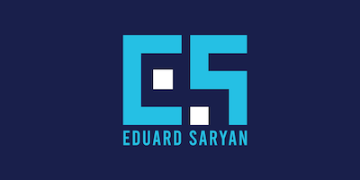

### Dockerized Laravel with Nginx

### Status
   

### Table of contents
* [Prerequisites](#Prerequisites)
* [Project Tree](#Project-Tree)
* [Backup Folder](#Backup-Folder)
* [Config Folder](#Config-Folder)
* [Rename](#Rename)
* [Deployment](#Deployment)
